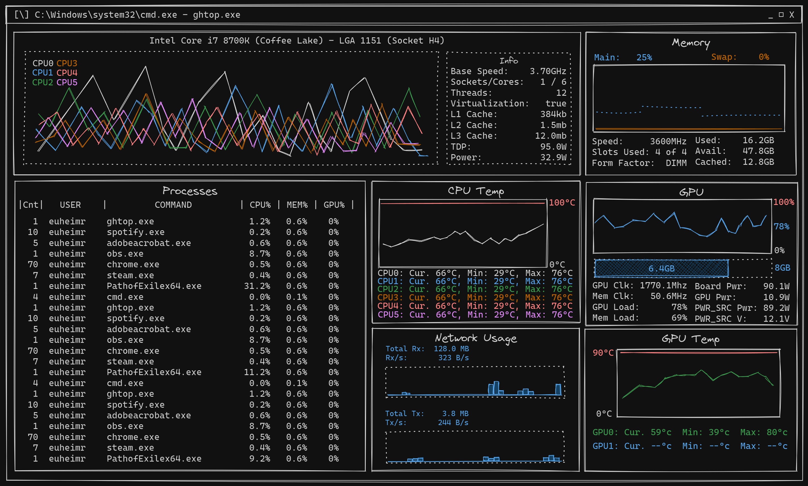

# ghtop (go htop)

*A Cross-platform SysAdmin tool via clickable Terminal UI (TUI) written in pure Go*

This is an attempt at an iteration of `htop` in Golang as a terminal UI for system administrators, developers and engineers for troubleshooting and monitoring.

---
## Features

_Supports_:
- [x] Windows
- [x] MacOs
- [x] Linux (tested on Debian only at the moment)

_Requires_:
- Windows Terminal (NOT `conhost.exe` aka `cmd`)
- Powershell
- zsh (MacOS)
- bash (or any terminal supporting shell scripts)

**Please Note**: 

`cmd` or `conhost.exe` are NOT supported because unicode or braille for the graphs are not valid characters for the old and retired Windows console. [Windows Terminal](https://github.com/microsoft/terminal/releases) aka `wt` is installed by default on Windows 11 and replaces `cmd`/`conhost.exe`.

---

## Development

### Build

Build and run:

`sh ./run.sh`

To _always force_ a build, `cd` to the project directory and run:

`sh ./run.sh --build` or `sh ./run.sh -b`

### TODO
- [Compatibility]:
  - [ ] : `cmd` is not supported yet because braille from braille graphs cannot be displayed. (maybe change the glyphs from braille to lines?)

- [Modules]:
  - [ ] : Processes
  - [ ] : CPU
  - [ ] : CPU Temp
  - [ ] : Memory
  - [ ] : GPU
  - [ ] : GPU Temp
  - [ ] : Network

### Non-standard Dependencies

1. Text UI - [tview]("https://github.com/rivo/tview")
   - `go get -u github.com/rivo/tview`
2. Process utils - [gopsutil/v3](https://github.com/shirou/gopsutil)
   - `go get -u github.com/shirou/gopsutil/v3`
3. Config handling - [koanf](https://github.com/knadh/koanf)
   - `go get -u github.com/knadh/koanf/v2`
   - `go get -u github.com/knadh/koanf/providers/file`
   - `go get -u github.com/knadh/koanf/parsers/toml`

### Contributing
    !TODO

---

## Built With:

 - tview
 - tcell (tview dependency)
 - gopsutil
 - drawille-go

---

## Reference

### Design Mockup

